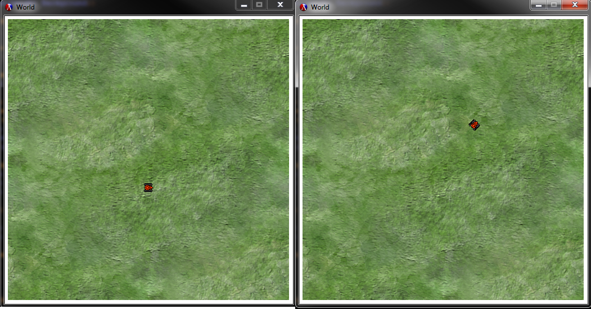

## 2htdp/universe
My name: Jeremy W. Joubert

For this exploration I was determined to build upon my previous assignment by incorporating
another library in conjunction with the 2htdp/image library. Using the library I
started by picking up where I had left off by creating some definitions for objects
that will be used in the final product of this project, such as  defining a tank object
as a structure composed of its necessary elements, i.e. orientation (angle),
speed, and position. Likewise, this will eventually be done for other objects
that will be in the game, like shells that are fired, obstacles, and so on. 

The universe library is, in my opinion, rather intimidating with it's name, but once
I realized that a single world is as far as I am going for now, it was less so. A world
is comprised of a scene and objects that are part of it, and this is what is updated
as the program animates. The key thing to remember is that the world is looking for
a function that will create a scene, not just an image. This way, it will be able
to use that function in order to update what is being displayed.

With a scene function up and running, the next part of this was to create some secondary
functions to calculate movement, angle changes and speed. This is done with definitions
for various formulas that would calculate things as needed. For now, the vehicle only 
changes direction in 45 degree increments as a proof of concept though. 

Last, was to incorporate key strokes as input to give control. Currently, WAD or Up, Left, Right
will move the tank in the corresponding direction. Below is some samples of the code used
to accomplish this:

```racket
;; Moves the tank forward in the direction faced
(define (move-tank t)
  (make-tank (add-posns (tank-posn t)
                        (posn* (angle->posn (tank-angle t))
                               (tank-speed t)))
             (cond ((zero? (tank-speed t)) 0)
                   ((> (tank-speed t) 0) (- (tank-speed t) 1))
                   (else (+ (tank-speed t) 1)))
             (tank-angle t)))
```

And this works in conjunction with some of the calculations that are made in helper
functions such as the following:

```racket
;; Takes an angle in degrees and returns a directional Posn
;;   Accounts for the downward-increasing Y-axis of scenes/images
;;   by multiplying the posn-y by -1
(define (angle->posn a)
  (make-posn (inexact->exact (round (cos (* a pi 1/180))))
             (* -1 (inexact->exact (round (sin (* a pi 1/180)))))))

;; Adds two Posns together.
(define (add-posns a b)
  (make-posn (modulo (+ (posn-x a) (posn-x b)) WIDTH)
             (modulo (+ (posn-y a) (posn-y b)) HEIGHT)))

;; Multiplies a Posn by a given number.
(define (posn* p n)
  (make-posn (modulo (* (posn-x p) n) WIDTH)
             (modulo (* (posn-y p) n) HEIGHT)))

;; Checks if two posns are equal.
(define (posn=? a b)
  (and (= (posn-x a) (posn-x b))
       (= (posn-y a) (posn-y b))))

;; Rotates tank within the world.
(define (turn deg w)
  (make-world (make-tank (tank-posn (world-player1 w))
                         (tank-speed (world-player1 w))
                         (modulo (+ deg (tank-angle (world-player1 w))) 360))))

;; Increases the tank speed factor
(define (accelerate w)
  (make-world (make-tank (tank-posn (world-player1 w))
                         (if (>= 7 (tank-speed (world-player1 w)))
                             (+ 7 (tank-speed (world-player1 w)))
                             (+ 0 (tank-speed (world-player1 w))))
                         (tank-angle (world-player1 w)))))
```						 
While the only value returned currently is the world procedure, below I have included
some screenshots of the program as it executes.



As a note, the images/sprites used in this were obtained from opengameart.org, and
all credit for these images belongs to their creators.
