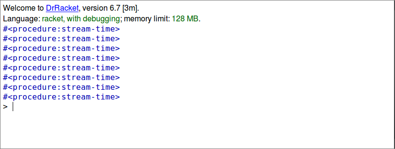

# FP3: Final Project Assignment 3: Exploration 2

## My Library: RSound
My name: Andrew Long

I will be using the RSound library for generating various sounds needed to simulate the sounds a piano keyboard will make. This library is located at https://docs.racket-lang.org/rsound/index.html. 

I started off testing this library by making definitions for piano keys ranging from A4 to C6. These definitions need to be coded in because each key has its own frequency. The frequencies are represented using RSound's sine-wave function, which is a signal that represents a sine wave of the given frequency at a default sample rate of amplitude 1.0. Below is the code for the representation of the piano keys A4-C6.
```
#lang racket
(require rsound)

(define A4-key
  (network ()
           [A4 <= sine-wave 440]
           [out = A4]))
(define B4-key
  (network ()
           [B4 <= sine-wave 493.883]
           [out = B4]))
(define C5-key
  (network ()
           [C5 <= sine-wave 523.251]
           [out = C5]))
(define D5-key
  (network ()
           [D5 <= sine-wave 587.330]
           [out = D5]))
(define E5-key
  (network ()
           [E5 <= sine-wave 659.225]
           [out = E5]))
(define F5-key
  (network ()
           [F5 <= sine-wave 698.456]
           [out = F5]))
(define G5-key
  (network ()
           [G5 <= sine-wave 783.991]
           [out = G5]))
(define A5-key
  (network ()
           [A5 <= sine-wave 880]
           [out = A5]))
(define B5-key
  (network ()
           [B5 <= sine-wave 987.767]
           [out = B5]))
(define C6-key
  (network ()
           [C6 <= sine-wave 1046.50]
           [out = C6]))
```
With these keys defined, we can play them using RSound's "signal-play" function.
```
#lang racket
(require rsound)
(signal-play C5-key)
(sleep 1)
(stop)

(signal-play D5-key)
(sleep 1)
(stop)

(signal-play E5-key)
(sleep 1)
(stop)

(signal-play F5-key)
(sleep 1)
(stop)

(signal-play G5-key)
(sleep 1)
(stop)

(signal-play A5-key)
(sleep 1)
(stop)

(signal-play B5-key)
(sleep 1)
(stop)

(signal-play C6-key)
(sleep 1)
(stop)
```
The code above plays sounds that represent the piano keys C5 to C6, which is right in the middle of most traditional piano keyboards, and generally where most of the keys are pressed. The sleep and stop functions are required so that racket does not keep playing the key forever. The sleep function is called to allow the keys to play for one second each. The stop function is called to stop the key from playing and to allow the next key to play without any other noises. Right now, the audio produced sounds very artificial and robotic. Future work may include having played keys trail off slowly like they do with actual pianos when a key is pressed and held down. Future work will definitely include adding a scaling factor to the frequencies to allow the user to play keys from other parts of the keyboard. This part will be implemented with some sort of keyboard key-press detection.

I would display a diagram of what my code produced; however, it's pretty difficult to see sound.

There exists some sort of output when the racket file is run in DrRacket. This is a result of RSound's network function being called and given a sound wave frequency. It's not particularly useful in any way.

