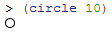
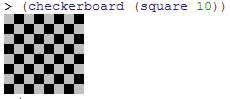
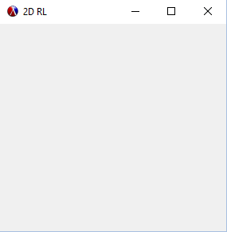

Slideshow / Math
My name: Thaddeus Ciras

My plan was to look at the racket math library to get an idea for how to do the colissions between the ball and the cars.
It turns out, all of the functionality you would need is built in to the main part of racket.

* angles - for colissions with objects
* pi - for dealing with the circular ball

For this reason I drifted away from the math library and started looking for visual libraries.
I came across slideshow, which does the things I want, but I don't know if it does them in the way I want yet.

The slideshow library creates very simple images in the active window.  For example, typing
```racket
(circle 10)
```
returns a circle with radius 10 pixels



Although the goal is to have a seprate window that the user can interact with, this is at least a good start.
I decided to make a checkerboard in the mannow we did in Computing II lab, but the code for one was already provided.  I made
some slight changes to it, but here is a basic explination of how it works.
```racket
(define (square s)
  (filled-rectangle s s))
(define (four p)
  (define two-p (hc-append p p))
  (vc-append two-p two-p))
(define (checker p1 p2)
  (let ([p12 (hc-append p1 p2)]
        [p21 (hc-append p2 p1)])
    (vc-append p12 p21)))
(define (checkerboard n)
  (let* ([gp (colorize n "gray")]
         [bp (colorize n "black")]
         [c (checker gp bp)]
         [c4 (four c)])
    (four c4)))
 ```
 The way this works is using squares, or filled rectangles in a perticular order to create the pattern.  The basics of what
 need to happen is that the colors need to alternate, and the result needs to come out as a square.  Starting in the
 checkerboard code, it can be seen that there is a special form of let:
 ```racket
 (let* (...))
 ```
 This allows for the parameters to rely on eachother, so long as later parameter only relys on earlier parameters. From there it 
 uses the checker code to alternate the colors and the four code to create a 2x2 block.
 ```racket
 (define (four p)
  (define two-p (hc-append p p))
  (vc-append two-p two-p))
```
hc-append puts each of the objects in its parameter list horizontally, while vc-append does the same thing but vertically.
The combination of these things allows for the creation of a checkerboard



Finally, there is a way to create a new window.
```racket
(define (makeFrame w h)
  (new frame% [label "2D RL"]
       [width w]
       [height h]
       [alignment '(center center)]))
```
I wrote this so that the size of the frame could be easily adjusted when we want to actually use it for the project. The ability
to create an image frame outside the main window is exactly what the final game is going to need.  I was unable to figure out how
to easily draw in the window, but I plan on spending some time over the next week getting tht working along with basic control
over a car.


