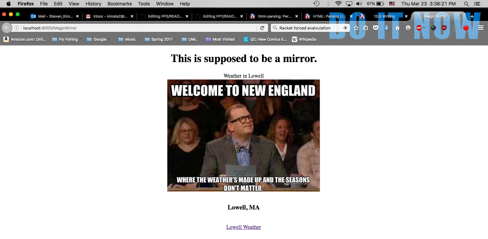

# FP3: Final Project Assignment 3: Exploration 2
## Library Name
My name: Steve Kim 

Library: web-server/servlet
http://docs.racket-lang.org/web-server/run.html


I explored the web-server library specifically the servelet part.  This will be used to display our magic mirror.  As an experiment I made a [local] webpage. The webpage is fairly basic composed a title, a header, text, a picture and a hyperlink.  
The portnumber(9000 in the screenshot), hyperlink suffix can be tailored as needed(magic mirror).  There is as well an option for an external conneciton. I was able to as well centered the main components of the webpage and will have to conintue to look at other ways to format (spatially) both texts, hyperlinks and images are positioned.  

* highlights of code that you wrote, with explanation
* output from your code demonstrating what it produced
* at least one diagram or figure showing your work
```racket
(define test_list '("Lowell, MA", "Dayton, OH", "Porlant, OR", "Camden, ME"))
(define test_list2 '(5, 3, 1))
(define second (car test_list2))
(define first( car test_list))
(define (start req); start is a function that takes a request 
  (response/xexpr
   `(html (head (title "Magic Mirror")); this is the title of the webpage
          (body
           (center(h1 "This is supposed to be a mirror.")); this prints out a header 
           (center "Weather in Lowell"); this prints out a new paragraph of text 
          (center(img ([src "test.jpg"]))) ; this prints out an image 
          (br) 
          (center(h3, first) ; prints out from a list

          (br)
          (center(h4, (number->string second)))
          (center '(a ((href "https://www.google.com/search?q=lowell+weather&ie=utf-8&oe=utf-8")) "Lowell Weather")); puts in ; a hyperlink titled Lowell Weather, the a stands for an anchor 
           )))))
```
The narrative itself should be no longer than 350 words. 

You need at least one image (output, diagrams). Images must be uploaded to your repository, and then displayed with markdown in this file; like this:




