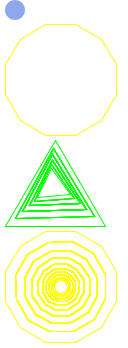
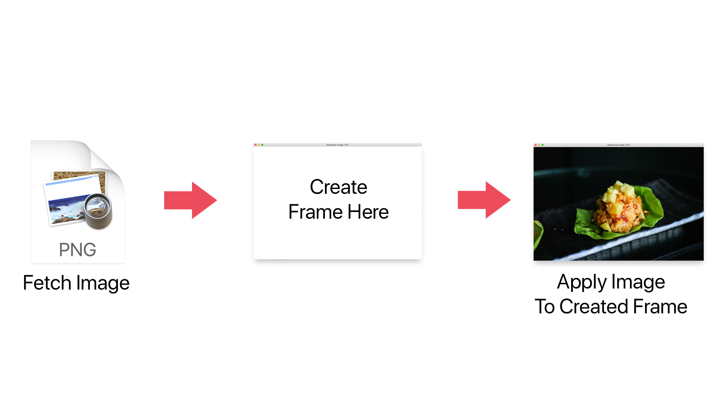

<h1>My Library: (racket/draw)</h1>
My name: Serey Morm

Since we really are dabbling with APIs in racket, it's no doubt that we're going to use the `json` library. So I decided that we definitely wanted to display our the data and information from our response data. I chose racket/draw because it would allow me to display an image, not locally but from a url-string.

Some commands I tried:
  - `(read-bitmap)`
  - `((new frame% [label "String to Display"]))`
  - `message%` (part of the frame)
  - `send` use to evaluate objects such as images

Line-by-line description of each commands used are in explorationThree.rkt
<h2>Output Image:</h2>

<h2>Diagram</h2>

