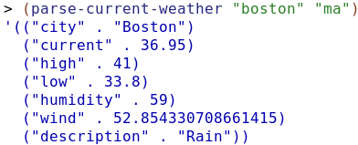

## Libraries: net/url, json, and 2htdp/batch-io
My name: **Steve Warren**

The following three libraries are used to download and parse weather data from [OpenWeatherMap](http://openweathermap.org/). These libraries and the included code will be used in support of Final Project.

**net/url:** allows for the aquisition of weather data.  
**2htdp/batch-io:** allows for filesystem access.  
**json:** allows for parsing of the data set.

The following code acquires the JSON and stores it locally:
```racket
(define (get-current-weather city state-country)
  (define (openweathermap city state-country)
    (string-append current-weather-url (location-format city state-country) options key))
  
  (define (location-format city state-country)
    (string-append city "," state-country))

  (define file-path (string-append "weather_data/current/" city " - " state-country ".json"))
  (define remote-data (port->string (get-pure-port (string->url (openweathermap city state-country)))))

  (write-file file-path remote-data)
  )
```
Resulting JSON (beautified):
```json
{
  "coord": {
    "lon": -71.06,
    "lat": 42.36
  },
  "weather": [
    {
      "id": 501,
      "main": "Rain",
      "description": "moderate rain",
      "icon": "10d"
    },
    {
      "id": 701,
      "main": "Mist",
      "description": "mist",
      "icon": "50d"
    }
  ],
  "base": "stations",
  "main": {
    "temp": 36.95,
    "pressure": 1020,
    "humidity": 59,
    "temp_min": 33.8,
    "temp_max": 41
  },
  "visibility": 16093,
  "wind": {
    "speed": 16.11,
    "deg": 210,
    "gust": 10.8
  },
  "clouds": {
    "all": 90
  },
  "dt": 1490384640,
  "sys": {
    "type": 1,
    "id": 1298,
    "message": 0.0059,
    "country": "US",
    "sunrise": 1490351921,
    "sunset": 1490396536
  },
  "id": 4930956,
  "name": "Boston",
  "cod": 200
}
```

With the data stored locally, its parsed and returned as a List of Cons.  This result will be used by my partner in support of his portion of the Final Project.

The following code parses the JSON and returns it:
```racket
(define (parse-current-weather city state-country)
  (define filename (string-append "weather_data/current/" city " - " state-country ".json"))
  (define json-data (call-with-input-file filename read-json))
  (define current-weather (list
                   (cons "city" (hash-ref json-data 'name))
                   (cons "current" (hash-ref (hash-ref json-data 'main) 'temp))
                   (cons "high" (hash-ref (hash-ref json-data 'main) 'temp_max))
                   (cons "low" (hash-ref (hash-ref json-data 'main) 'temp_min))
                   (cons "humidity" (hash-ref (hash-ref json-data 'main) 'humidity))
                   (cons "wind" (/ (hash-ref (hash-ref json-data 'wind) 'speed) 0.3048))
                   (cons "description" (hash-ref (car (hash-ref json-data 'weather)) 'main))
                   ))
  current-weather
  )
```

This is an example of the output that will be sent:  

